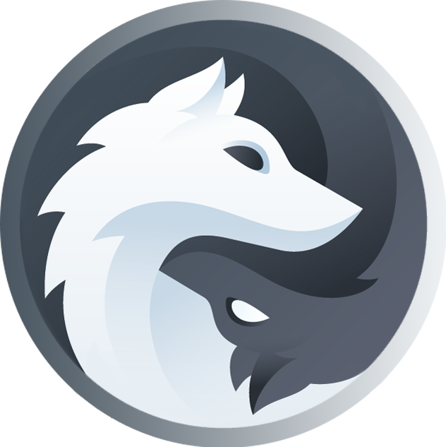

Alexandre Alleaume

Bryan Guillot 

Lucas Pisano																							BRANCODEURS

​																														Rapport

 

Le Projet-Vetux line devait prendre que 2 semaines, mais après quelques complications les professeurs nous ont accordés un délai supplémentaire (3 semaines). L’objectif est de créer une application permettant de fusionner des fichiers csv. L’utilisation du Framework symfony est demandée. Il faut que l’utilisateur puisse choisir entre un mélange séquentiel et entrelacé pour les fichiers csv.

En ce qui concerne la mise en place du projet, nous avons commencer par vérifier que nous ayons tous la même version de chaque outils que nous utiliserons (PHP, mariadb, xampp, phpStorm etc…). Puis nous avons créé un serveur discord pour pouvoir rapidement se transférer des données ou partager des Screenshots. Le serveur nous permet également de partager nos écrans en permanence aux autres.

 

Les premières étapes pour le projet étaient ces commandes pour la création des fichiers nécessaires (Framework) :

« composer install »

« composer create-project symfony/website-skeleton vetux »

« Composer require annotations »

 

Ensuite nous avons créé la base de données phpMyAdmin pour le projet. Pour cela nous avons réduit la taille des deux fichiers csv comme demandé. Nous obtenons donc deux tables.

Nous allons utiliser ces tables pour l’entièreté du projet. Si nous voulons utiliser les fichiers complets (2000 et 3000 lignes), il nous suffira d’augmenter la taille maximale de fichiers sur la DDB. Mais pour rendre les tests plus simples et compréhensifs, nous resterons avec les petits fichiers.

 

Début du développement.

Voici a quoi ressemble le formulaire après quelques problèmes qui ont pris pas mal de temps à régler. Il y avait tout d’abord un problème de droit sur les fichiers (besoin d’exécuter phpMyAdmin en mode administrateurs). Il y avait également un problème d’extension. Ce problème a mis un temps fou à se résoudre. Pour une raison qui nous échappe, l’extension fileinfo n’était pas reconnue alors qu’elle était activée dans php.ini. Cela nous a fait perdre énormément de temps car même les professeurs n’arrivaient pas à résoudre le problème. Finalement, ceux ayant le problème au sein du groupe ont continué de travailler sur une autre machine qui n’avait pas ce problème. (Le pc portable de Lucas.P a toujours ce problème).

 

Une fois que le groupe a enfin un projet qui fonctionne, nous avons améliorés les boutons d’upload qui maintenant n’acceptent uniquement les fichiers avec l’extension .csv.

Après quelques problèmes avec le bouton de déconnexion qui redirigeait l’utilisateur au localhost redirige maintenant à la page de login.

Pour continuer, nous avons fait le formulaire concernant les clients invalides, que ce soit pour la taille en cm ou inches, un code de carte de crédit invalide, ou encore l’âge du client (majeur ou non).

L’utilisateur peut donc sélectionner ce qu’il veut et obtenir un fichiers csv filtré.

 

 

Evil user story

 

Pour assurer que n’importe quel utilisateur ne puisse avoir un accès administrateur sur Vetux Line, nous utilisons : use Symfony\Component\Security\Core\Encoder\UserPasswordEncoderInterface; 

Ce qui a pour but d’encoder le mot de passe.

 

De plus, pour contrer la navigation par url (manipuler l’url pour accéder a des pages admin par exemple) n’est pas possible dans ce projet. C’est le cas ici car uniquement l’utilisateur auteur de ce projet possède les droits pour l’application. Cet utilisateur a été créé en même temps que la base.

Après un peu de css voici à quoi ressemble l’application

Nous pouvons maintenant ajouter des clients, visualiser les données avec un tableau et le css est complet.

 

Login

App

Sources :

https://symfony.com/doc/current/index.html

https://twig.symfony.com/doc/3.x/

https://developer.mozilla.org/fr/docs/Web/JavaScript

https://stackoverflow.com/questions/7977084/check-file-type-when-form-submit

https://stackoverflow.com/questions/1860490/interleaving-multiple-arrays-into-a-single-array

https://openclassrooms.com/forum/sujet/erreur-sqlstate-hy000-1044

https://stackoverflow.com/questions/29986626/pdoexception-1044-sqlstatehy000-1044-access-denied-for-user-localhost

https://csv.thephpleague.com/

https://www.apachefriends.org/docs/

https://www.phpmyadmin.net/docs/